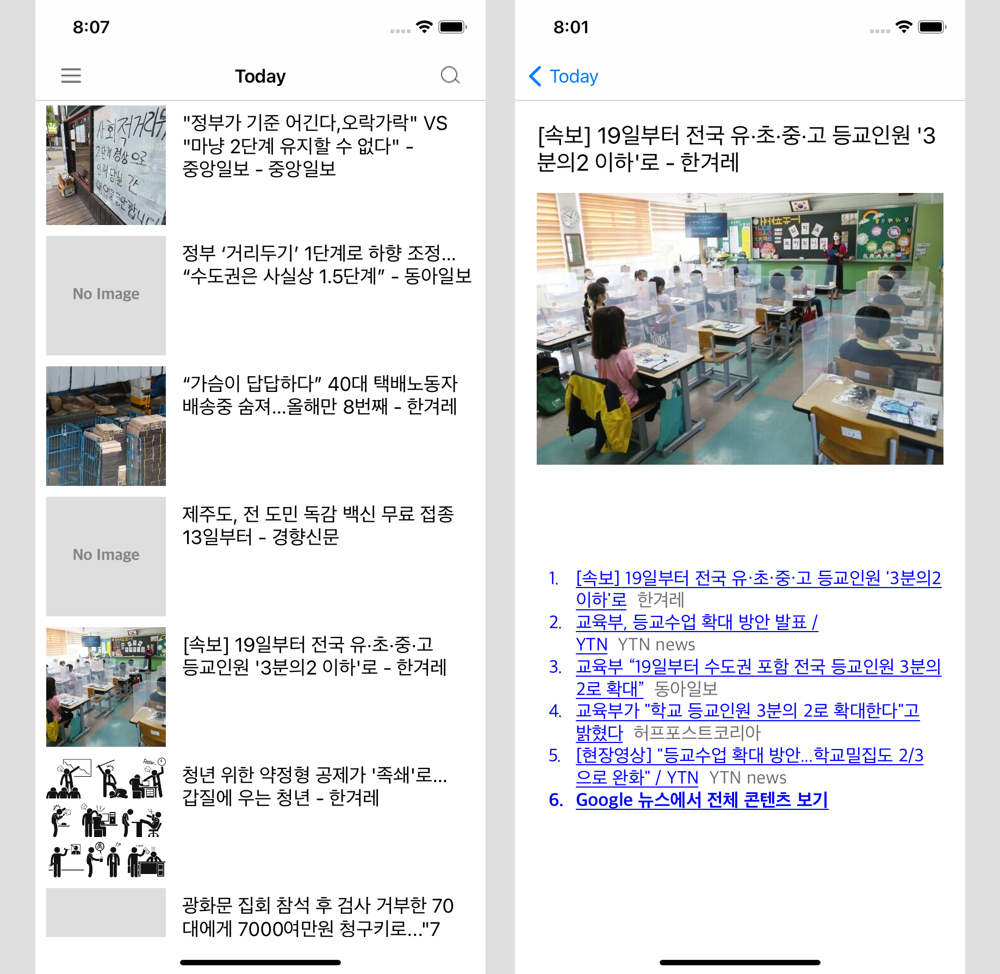
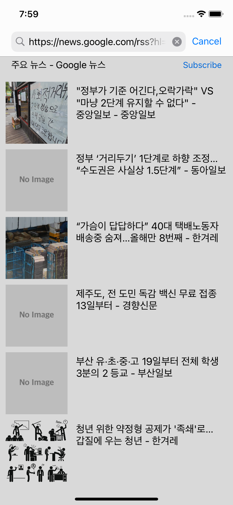
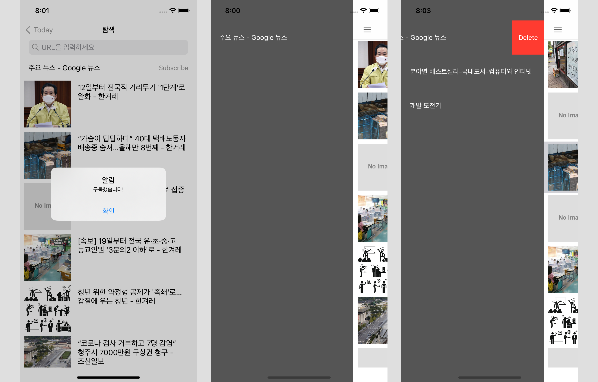

# SimpleRSSReader

## 요약

rss 파싱, rss 구독 등의 간단한 기능을 제공하는 rss 리더기 어플리케이션입니다.

- 개발 기간: 2020.09.11 - 2020.10.11 (1개월)
- 개발 인원: 1명
- 개발 언어 및 환경: Swift, Xcode

## 기능

- rss 파싱: 유저의 메인 메뉴에서 원하는 타이틀을 선택하면 해당 rss url을 불러와 파싱 후, 피드 형태로 표시합니다. 각 피드를 선택하면 상세 내용을 확인할 수 있습니다.

- rss 불러오기: 유저가 구독하고자 하는 url을 복사하여 검색창에 붙여 넣기 하면 결과를 피드 형태로 표시합니다. 검색 결과가 없을 경우 alert를 화면에 표시합니다.

- rss 구독: rss 검색 결과가 피드 형태로 표시되었을 때 유저는 subscribe 버튼을 통해 해당 rss url 정보를 저장합니다. 이후, 메뉴를 통해 손쉽게 접근 및 편집이 가능합니다.

## 히스토리

아래에 커밋 상세 내용을 기술하였습니다.

### Improve Performances
- 메인 화면을 불러올 때, URL 검색 결과를 표시할 때 퍼포먼스를 향상시켰습니다!🥳

### Update README.md and fix some bugs
- README.md를 업로드하고 검색 결과 화면에서 이미지가 보이지 않는 버그를 수정하였습니다.

### Add and Expand some functions

- 각 피드의 이미지를 표기할 수 있도록 구현하였습니다.
- 검색창에 rss url을 입력하면 파싱 결과를 확인할 수 있고 이를 구독할 수 있도록 구현하였습니다.
- 메뉴 편집 기능을 구현하였습니다.
- 사용자의 구독 정보를 저장할 수 있도록 아카이빙을 구현하였습니다.

### initial commit

- 애플리케이션의 전체 UI를 설계하고, 햄버거 메뉴를 적용하였습니다.
- 샘플 데이터를 메뉴에 적용하였고, rss 파싱 및 피드 상세 보기를 구현하였습니다.